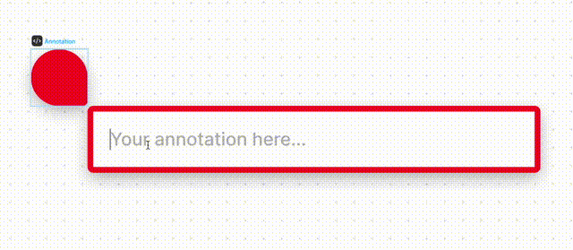

# Figma and FigJam Widget Samples

Widgets are custom, interactive objects you place in a [Figma](https://figma.com) or [FigJam](https://figma.com/figjam) file to extend functionality.

Widgets are written in a declarative style similar to React components, so developers can define what a widget looks like using a component-based API similar to React. If you have written React before you should feel right at home.

A widget is just a “pure function” that returns what gets rendered inside of a node. They can also have their widget run arbitrary code in response to various user interactions, such as click events. Widgets also have custom property menus similar to FigJam objects.

So far developers have built widgets for people to use together — like voting, polls, and on canvas games. You can see a full list of published [widgets here](https://www.figma.com/community/widgets/widgets).

Ready to make you first widget? Check out our [developer docs](https://www.figma.com/widget-docs) to get started!

## Widgets

### Widget Counter

A simple counter widget that showcases `<Frame>`, `<Text>`, `useSyncedState`, `usePropertyMenu`, and `onClick`.

### Widget Notepad

A widget that showcases the [`Input`](https://www.figma.com/widget-docs/api/component-Input/) component to get user input directly on the canvas.

### Widget UserBadge

A widget that makes use of `<Image>` and `figma.currentUser.photoUrl`.

### Widget Table

A simple table widget that showcases `useSyncedMap` to support concurrent updates to the widget and the `key` prop.

### Widget Multiplayer Counter

A multiplayer-safe counter widget that uses `useSyncedMap` and `figma.activeUsers[0].sessionId`

### Widget Toast

Demonstrating how to use a UI to send messages to a widget.

### Widget Simple Annotate

A simple widget for creating inline-editable annotations. It is [published to the community](https://www.figma.com/community/widget/1121551206624878752/Simple-Annotate).

### create-widget-app

An template widget that opens an iframe whose contents is rendered using React. This mainly serves to demonstrate how to structure code for non-trivial widgets and their iframes.
