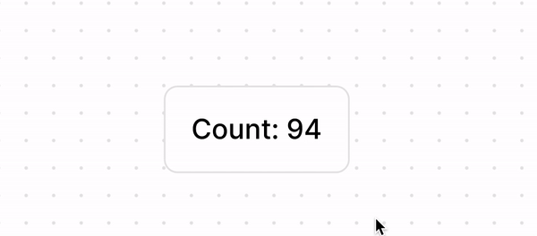

# hoverStyle

## Overview

Any component can take an optional `hoverStyle` property that takes on object overrides that will be applied if it or a parent with a mouse event listener is hovered.

Right now the only properties that can be overridden by a hover style are `fill`, `stroke`, and `opacity`.

```ts
interface HoverStyle {
  fill?: HexCode | Color | Paint | (SolidPaint | GradientPaint)[];
  stroke?:
    | HexCode
    | Color
    | SolidPaint
    | GradientPaint
    | (SolidPaint | GradientPaint)[];
  opacity?: number;
}
```

## Example

In the below example hovering over the button will make the containing `AutoLayout` black and the nested `Text` inside of it white.

```tsx
const { widget } = figma;
const { useSyncedState, usePropertyMenu, AutoLayout, Text, SVG } = widget;

function Widget() {
  const [count, setCount] = useSyncedState("count", 0);

  return (
    <AutoLayout
      verticalAlignItems={"center"}
      spacing={8}
      padding={16}
      cornerRadius={8}
      fill={"#FFFFFF"}
      stroke={"#E6E6E6"}
      onClick={() => setCount(count + 1)}
      hoverStyle={{
        fill: "#000000",
      }}
    >
      <Text hoverStyle={{ fill: "#FFFFFF" }} fill="#000000">
        Count: {String(count)}
      </Text>
    </AutoLayout>
  );
}

widget.register(Widget);
```

Here is a gif of it in action:

