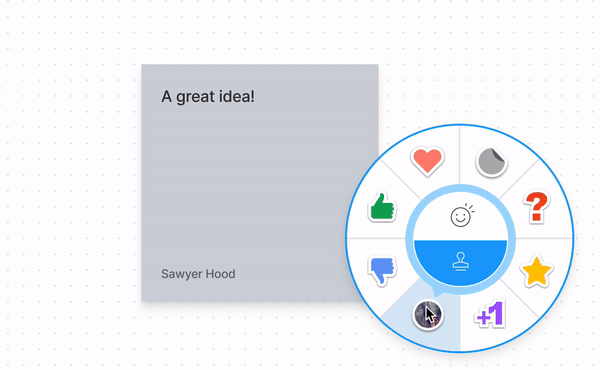

# Stickables

FigJam has recently added the concept of a stickable! A stickable is any node that sticks to other nodes when put on top. Currently FigJam has two built-in stickables: `STAMP` and `HIGHLIGHT` nodes. In addition you can now define a `WIDGET` node as being stickable if it uses the `useStickable` hook. Below is an example of a stamp stuck to a sticky.

We've added new apis that let you read stickables from the plugin api and let your widget be stickable or run code when something is stuck to it.

## New plugin APIs

These apis can be used in both plugins and widgets:

- [stuckTo](stuckTo.md)
- [stuckNodes](stuckNodes.md)

## New widget APIs

We've introduced two new hooks that can be used in widgets:

- [useStickable](useStickable.md)
- [useStickableHost](useStickableHost.md)
