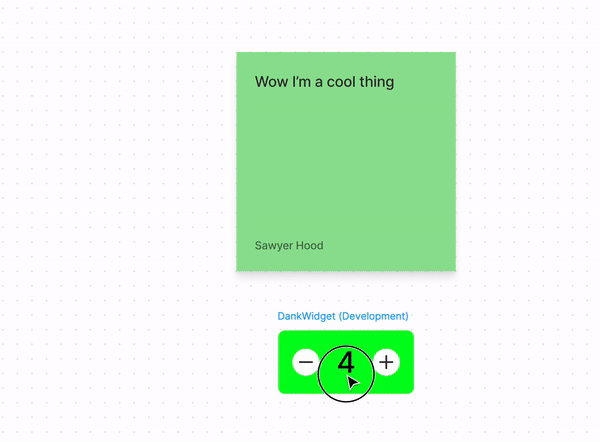

# useStickable

## Overview

`useStickable` is a new hook that if called in your widget it makes the widget stick to other nodes when dragged over them. The behavior is the same as if your widget was a stamp node.

```jsx
const { useStickable, Rectangle } = figma.widget;
function Widget() {
  // This widget sticks to other nodes now!
  useStickable();
  return <Rectangle width={100} height={100} fill="#F00" />;
}
figma.widget.register(Widget);
```



## Callback

`useStickable` can also take an optional callback that is called anytime your widget is stuck or unstuck to a new stickable host.

This callback takes a `WidgetStuckEvent` as a parameter:

```ts
interface WidgetStuckEvent {
  // This is the id of the new node that your widget is stuck to
  // or null if it is no longer stuck to anything
  newHostId: string | null;
  // This is the id of the node that your widget was stuck to or null if it isn't stuck to anything
  oldHostId: string | null;
}
```

It is often convinient to pair this with the [`stuckTo`](stuckTo.md) api.

## Example

This example changes the color of the widget depending on what type of node it is stuck to.

```jsx
const { useStickable, Rectangle, useWidgetId, useSyncedState } = figma.widget;
function Widget() {
  const widgetId = useWidgetId();
  const [color, setColor] = useSyncedState("color", "#000");

  // This widget sticks to other nodes now!
  useStickable(() => {
    const widget = figma.getNodeById(widgetId);
    const { stuckTo } = widget;
    if (!stuckTo) {
      // Set the color to black if the widget isn't stuck to anything.
      setColor("#000");
      return;
    }

    switch (stuckTo.type) {
      case "STICKY":
        // Make the widget red if we are attacked to a sticky
        setColor("#F00");
        return;
      case "SHAPE_WITH_TEXT":
        // Make the widget green if we are attached to a shape with text
        setColor("#0F0");
        return;
      default:
        // If we are attached to anything else make the widget blue
        setColor("#00F");
        return;
    }
  });

  return <Rectangle width={100} height={100} fill={color} />;
}
figma.widget.register(Widget);
```

## Other Rules

In FigJam a node is either a stickable or a stickable host, but never both. You cannot call `useStickable` and `useStickableHost` in the same render of a widget; it can only be one or the other.

By default all widgets are stickable hosts and can let stamps and other stickables stick to them.
